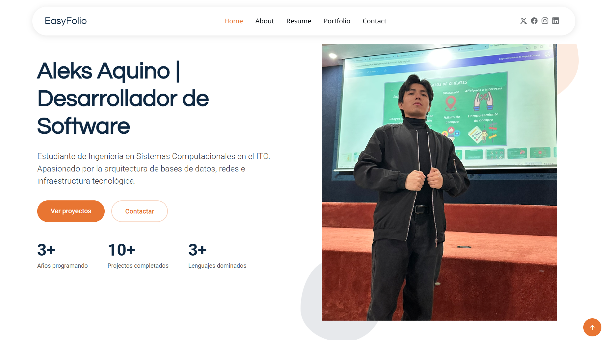
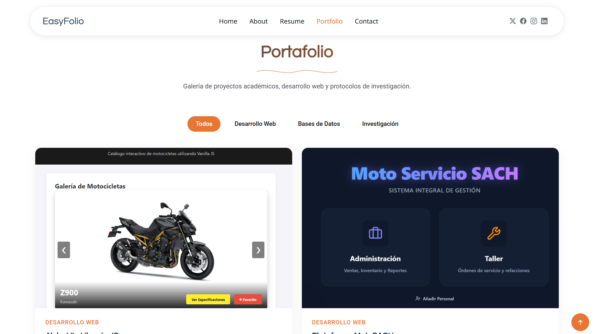
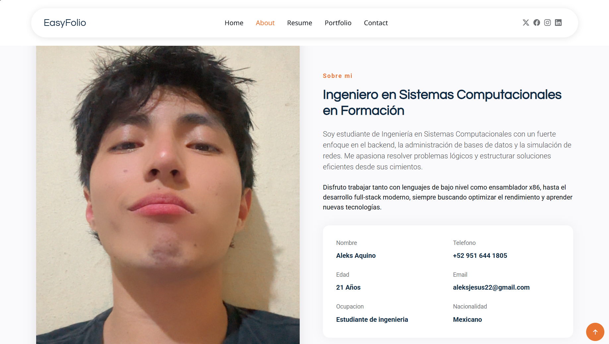

# Actividad 4: Portafolio Web con Bootstrap

**Autor:** Aleks Jesús Aquino Rosales  
**Institución:** Instituto Tecnológico de Oaxaca (ITO)  
**Carrera:** Ingeniería en Sistemas Computacionales  

---

## 📌 Descripción del Proyecto
Este repositorio contiene el código fuente de mi portafolio web profesional y académico. El objetivo de este proyecto es aplicar buenas prácticas de estructura de directorios, personalización de plantillas y despliegue estático.

👉 **[Ver Portafolio en Vivo (GitHub Pages)](https://aleksardio.github.io/Actividad4-Portafolio/)**

---

## 🛠️ Tecnologías y Plantilla Base
*   **Framework CSS:** Bootstrap
*   **Plantilla utilizada:** [EasyFolio de BootstrapMade](https://bootstrapmade.com/easyfolio-bootstrap-portfolio-template/)
*   **Lenguajes:** HTML5, CSS3, Vanilla JavaScript

## 📂 Estructura de Secciones
El portafolio está dividido en las siguientes secciones principales:
1. **Inicio (Hero):** Presentación principal con fotografía profesional y descripción breve de mi perfil como desarrollador.
2. **Sobre Mí (About):** Detalles sobre mis intereses técnicos, lenguajes dominados (C++, Java, JS, etc.), experiencia con bases de datos y datos personales.
3. **Currículum (Resume):** Línea de tiempo con mi formación en el ITO y mi participación en proyectos técnicos y protocolos de investigación.
4. **Proyectos (Portfolio):** Galería interactiva (filtrable) mostrando proyectos reales y académicos como *MotoSACH*, *Aleks UI*, *ECORUTA* y *Siembra Oaxaca*.
5. **Contacto (Contact):** Formulario de contacto y datos de ubicación en Oaxaca.

---

## ⚙️ Proceso de Creación (Paso a Paso)

Para adaptar la plantilla original a los requerimientos de la rúbrica, seguí esta metodología:

1. **Descarga y Extracción:** Descarga de los archivos fuente de la plantilla *EasyFolio*.
2. **Reestructuración Estricta de Directorios:** 
   * Se eliminó la carpeta genérica `assets/`.
   * Se movió y renombró el archivo CSS principal a `css/portafolio.css`.
   * Se movió y renombró el script principal a `js/portafolio.js`.
   * Se extrajeron las dependencias (Bootstrap, Swiper, GLightbox) a una carpeta `vendor/` en la raíz, actualizando todas las rutas en el `<head>` y `<body>` del HTML.
3. **Limpieza de Código:** Se eliminaron las páginas secundarias innecesarias (`portfolio-details.html`, `services-details.html`) y secciones del HTML que no aportaban valor al perfil de estudiante (Servicios, FAQ, Dropdowns).
4. **Traducción y Personalización:** Se tradujo el menú de navegación y las tarjetas al español. Se inyectó información verídica sobre mi carrera, habilidades en bases de datos y desarrollo backend.
5. **Integración de Proyectos:** Se configuró el script *Isotope* para filtrar la galería de proyectos, asignando categorías como "Desarrollo Web", "Bases de Datos" e "Investigación".
6. **Despliegue:** Inicialización del repositorio local en Git y despliegue a través de GitHub Pages desde la rama `main`.

---

## 📸 Capturas de Pantalla

*(Aquí se muestra el portafolio renderizado en el navegador)*

